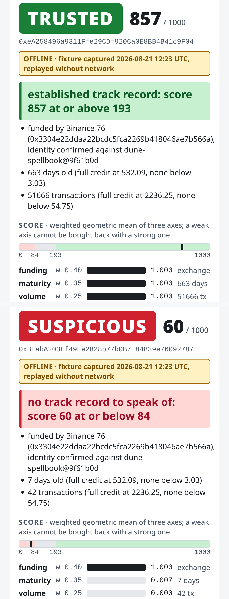
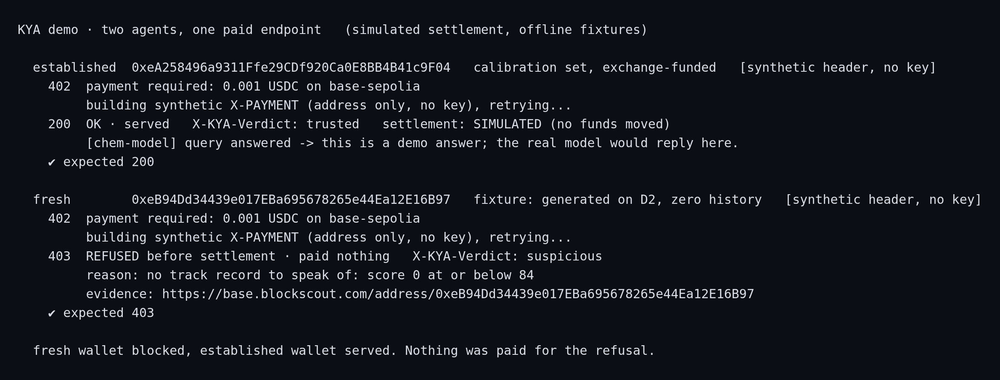

# KYA: Know Your Agent


**On-chain reputation for AI agents that pay through x402.**

AI agents already buy services with stablecoins over x402: 7M+ transactions in
a rolling 30-day window (x402scan, Aug 2026), and over 100M cumulative for the
protocol (Chainalysis, Coinbase, agenteconomy.to), at a sub-dollar average
ticket. The seller sees a valid payment and nothing else: no history, no way to
tell an established agent from a wallet created five minutes ago.

x402scan, the ecosystem's main explorer, built by Merit Systems and open
source and not an official x402 project, has a per-address buyer page
(`/buyer/<address>`, since March 2026) showing that address's x402 payment
history. It has no public API for it, and it says nothing about a wallet's
general Base history, which is the question KYA answers. So a wallet with two
years of Base activity and no prior x402 payment has an empty buyer page:
to anything reading x402 history it is a cold start, and to KYA it is a track
record.

KYA answers the missing question: **who is this agent, and what has it done?**

## Live

    https://kya-know-your-agent-production.up.railway.app

```bash
curl "https://kya-know-your-agent-production.up.railway.app/verify?address=0xeA258496a9311Ffe29CDf920Ca0E8BB4B41c9F04"
```

**Production attester: `0xb6dFf3cf677d1567290be23C283171Accf89dEB7`.** Pin that
address to check signatures. It is published here, out of band, on purpose:
"verifiable without trusting this API" only means something if the API does not
get to tell you whose signature to trust. It is **not** the attester in the
examples below, which is a local development key.

Hosted: `GET /verify` and the split-screen UI at `/`. Not hosted: the x402 gate
demo under `demo/`, which is a seller process plus a payment facilitator and
runs locally (see [Try it](#try-it)).

Limits: 500 live verifications a day. Past that the service keeps answering, but
replays a committed dated capture instead of reading Blockscout and says so in
the headers (`X-KYA-Source: fixture`, `X-KYA-Degraded: budget`). Every response
carries `X-KYA-Source: live | cache | fixture`, so a caller can always tell
which one answered. Also per IP: 30 `/verify` requests a minute, past which the
rest of that minute gets `429` with `RateLimit-*` and `Retry-After` headers,
so no single caller can spend the whole day's budget for everyone else.

## Documentation

- [`docs/ARCHITECTURE.md`](docs/ARCHITECTURE.md): how it works end to end. The
  path from agent to settlement, the six calls and four signals inside the gate,
  where each list comes from, and what is on-chain versus off-chain.
- [`docs/POSITIONING.md`](docs/POSITIONING.md): why this is not sanctions
  screening, who pays for it and what it costs to run, and where the scoring
  rules live.
- [`docs/API.md`](docs/API.md): the `GET /verify` contract: parameters,
  headers, response format, status codes, and how to tell live, cache and
  fixture apart.
- [`docs/SECURITY-SUMMARY.md`](docs/SECURITY-SUMMARY.md): the security posture:
  threat model, what the attestation does and does not prove, and the real
  status of every known finding.
- [`SECURITY.md`](SECURITY.md): how to report a vulnerability.
- [`CONTRIBUTING.md`](CONTRIBUTING.md): build, test and pull-request flow.



*Same funder, confirmed against the same label set. 857 and 60.*

## What it does

    GET /verify?address=0x...

Returns a signed attestation:

```jsonc
{
  "address":   "0xeA258496a9311Ffe29CDf920Ca0E8BB4B41c9F04",
  "verdict":   "trusted",              // trusted | unknown | suspicious
  "gated":     false,                  // compliance gate (OFAC SDN + this project's mixer denylist): "not allowed", not "no history"
  "score":     857,                    // 0..1000
  "summary":   "established track record: score 857 at or above 193",
  "reasons":   ["funded by Binance 76 (0x3304e22d...7b566a), identity confirmed against dune-spellbook@9f61b0d", "..."],
  "signals":   { "age_days": 662.73, "tx_count": 51666, "distinct_counterparties": 2,
                 "txs_24h": 150, "txs_7d": 150, "burst_ratio": 4.5,
                 "funding": { "class": "exchange", "source": "0x3304e22d...7b566a", "via": "native",
                              "funder_label": "Binance 76", "label_source": "dune-spellbook@9f61b0d", "..." : "..." },
                 "...": "..." },
  "evidence":  { "chain_id": 8453,
                 "blockscout_url": "https://base.blockscout.com/address/0xeA25...9F04",
                 "window": { "size": 150, "max": 150, "capped": true },
                 "fetched_at": "2026-08-21T12:23:39.247Z" },
  "attester":  "0xCEFEDCf160e8065ce82B949A0dFc777BD2E2Cd8C",
  "issued_at": "2026-08-21T12:23:45.118Z",
  "signature": "0x80b15b6b...b1d82c1c"   // EIP-191 over everything above
}
```

- **Deterministic.** Three scored axes from the agent's Base history: age,
  volume, and funding provenance. Combined with a weighted geometric mean, so a
  weak axis cannot be compensated by a strong one. Counterparty diversity and
  recent cadence are also read from the chain and shown, but carry weight zero;
  cadence enters the score only as a burst penalty. No LLM anywhere in the
  pipeline.
- **Calibrated, not invented, and explicit about which is which.** The
  *thresholds* are MEASURED: derived from a labeled reference set of 30 real
  addresses, and `scripts/calibrate.ts` reproduces every one of them. The
  *weights* are CHOSEN: ranked by how expensive each axis is to forge, argued in
  `src/config.ts` and not measured, because no labelled set available could
  measure them. The file labels every constant as one or the other. Two of the
  four signals (diversity, cadence) did not separate the set and carry weight
  zero; they are still reported as evidence.
- **Verifiable without trusting this API.** `evidence` links to the raw history
  on Blockscout. `signature` is EIP-191; any service checks it in 3 lines:

  ```ts
  import { recoverMessageAddress } from 'viem'

  const { signature, ...body } = await (await fetch(`${KYA}/verify?address=${agent}`)).json()
  const signer = await recoverMessageAddress({ message: JSON.stringify(body), signature })
  if (signer !== KYA_ATTESTER) throw new Error('not signed by KYA')   // pin the attester you trust
  ```

  The signed message is the attestation without `signature`, as canonical JSON
  (RFC 8785: keys sorted recursively, no whitespace). The API serves it already
  in that order, which is why `JSON.stringify` of the parsed body is enough in
  JavaScript. In Python it is `json.dumps(body, sort_keys=True, separators=(',', ':'))`;
  the two produce identical bytes. The attester address is printed when the
  server starts and echoed in `attester` for discovery, but a consumer decides
  which attester to trust, not the payload. A hosted deployment signs with its
  own production key, so the attester shown in these examples is **not** the one
  a live response carries: pin the address the running server prints, not the
  one printed here.

  Attestations are point-in-time. `issued_at` says when; consumers decide their
  own freshness policy.

## The gate

`kyaGate` is x402 middleware. It reads the payer address from the payment
header and blocks `suspicious` agents with 403 **before settlement**: the
rejected agent pays nothing, the seller risks nothing. `unknown` passes with
an `X-KYA-Verdict` header; blocking it is the seller's choice.

```ts
import { paymentMiddleware } from 'x402-express'
import { kyaGate } from './src/gate.js'

app.use(kyaGate())                                          // 1. who is paying, what have they done
app.use(paymentMiddleware(payTo, { 'GET /chem': { price: '$0.001', network: 'base-sepolia' } }))
app.get('/chem', handler)                                   // 3. served only past both
```

The order is the mechanism: x402-express settles only after the handler answers
2xx, and it never runs if the gate answered first. The gate reads
`payload.authorization.from` from the `X-PAYMENT` header and does not check
the signature over it; the payment middleware does, so a forged `from` fails
there and never settles. Requests without a payment header pass through so the
client can receive the 402 with the payment requirements.



*The fresh wallet signs a payment and is refused with 403 before x402 settles: it pays nothing.*

A refusal carries the reason and the signed attestation, so the refused agent
can verify the claim against Blockscout itself:

```jsonc
HTTP/1.1 403 Forbidden
X-KYA-Verdict: suspicious

{ "error": "KYA gate: payer refused before settlement",
  "verdict": "suspicious", "gated": false, "score": 0,
  "reason": "no track record to speak of: score 0 at or below 84",
  "reasons": ["no inbound transfer ever: nothing funded this wallet", "..."],
  "payer": "0x8b00...C54f",
  "evidence": "https://base.blockscout.com/address/0x8b00...C54f",
  "attestation": { "...": "the signed attestation above" } }
```

`gated: true` means the compliance gate fired: the address was not scored, it
was blocked. Two lists feed it, and they are not the same kind of obligation.
The OFAC SDN list is a legal requirement. The mixer denylist is this project's
own policy choice: Tornado Cash left the SDN list in March 2025, so no
sanctions regime obliges it. If reputation cannot be read the gate fails closed
with 503, still before settlement.

## Try it

    npm i
    cp .env.example .env

Every attestation is signed, offline ones included, so one key is always
needed: a throwaway attester that never holds funds. Generate it and put it in
`.env` as `ATTESTER_PRIVATE_KEY`:

    node -e "import('viem/accounts').then(a => console.log(a.generatePrivateKey()))"

That is everything offline mode needs. No Blockscout key, no network:

    npx tsx src/cli.ts --offline 0xeA258496a9311Ffe29CDf920Ca0E8BB4B41c9F04   # replays a committed fixture
    npx tsx src/server.ts --offline                      # GET /verify + the demo UI at /
    open http://localhost:3000/?offline=1                # two agents side by side
    npm test                                             # 6 tests, offline: no key, no network, committed fixtures

Reading Base mainnet live needs `BLOCKSCOUT_API_KEY` in `.env` as well:

    npx tsx src/cli.ts 0xYourAddress                     # verdict, score, why, signature
    npx tsx src/server.ts                                # GET /verify + the demo UI at /
    curl "localhost:3000/verify?address=0xYourAddress"
    open http://localhost:3000/                          # two agents side by side

The UI is one static file (`ui/index.html`, no build, no dependency): two
panels, each with an address field and one-click demo agents. Per panel it
shows the verdict, **the reason in text**, the score against the calibrated
cutoffs, the three weighted axes, the collected-but-unscored signals, and the
Blockscout evidence link. It calls `/verify?address=…&explain=1`, which returns
`{ attestation, breakdown }`: the same signed attestation plus the unsigned
score arithmetic (axes, weights, penalty, confidence, cutoffs) so the screen
can draw why the score is what it is. Bookmark `/?a=0x…&b=0x…` to preload both.

The demo, two terminals. Reputation is read from Base mainnet; the payment
runs on Base Sepolia with the same address:

    npx tsx demo/paid-endpoint.ts                        # seller: paid endpoint behind the gate
    npx tsx demo/agents.ts                               # buyers: established wallet 200, fresh wallet 403

By default settlement is **simulated**: x402-express runs for real but is
pointed at a stub facilitator inside the endpoint process, so no testnet funds
are needed. The fresh agent is a real `x402-fetch` client (a zero-balance
wallet can still sign); the established agent sends a synthetic `X-PAYMENT`
header because its key is not ours. Add `--real` to both commands to settle
through `x402.org/facilitator`; then set `DEMO_ESTABLISHED_PRIVATE_KEY` to a
wallet with history holding Sepolia USDC, and `DEMO_PAY_TO` to your address.

## Offline mode: fixtures are dated captures of live addresses

Blockscout answered 500 for 23 of 30 sampled addresses during an August 2026
collection run, so the demo does not depend on it being up:

    npx tsx scripts/capture.ts                 # reads Blockscout NOW, writes data/fixtures/<address>.json
    npx tsx src/cli.ts --offline 0xeA25...     # replays the fixture, no network, no Blockscout key
    npx tsx src/server.ts --offline            # every request replays data/fixtures/
    npx tsx demo/paid-endpoint.ts --offline    # the gate replays too (pair with demo/agents.ts --offline)

`data/fixtures/` holds four committed captures: the three demo cases (established
`0xeA25…9F04`, fresh exchange-funded `0xBEab…2787`, OFAC-listed `0x098b…2f96`)
and one address with zero transactions (`0xeB94…6B97`, generated locally, key
discarded). **They are not synthetic cases.** Each file is what Blockscout
returned for a live address at the instant in its `captured_at`; the addresses
have kept living since, so a live read can differ. An attestation replayed from
a fixture has the same format and signature as a live one and carries the
capture instant as `evidence.fetched_at`, next to a fresh `issued_at`, so any
consumer can tell a replay from a fresh read. Responses also say
`X-KYA-Source: live | cache | fixture`.

The same file format is the live mode's 10-minute cache (`data/cache/`,
gitignored): a fixture is a cache entry that was kept. A live server also
honours `?offline=1` per request, and the UI has an *offline* toggle, so the
demo flips to fixtures without a restart. In offline mode a request resolves in
three steps: the committed fixture, then `data/cache/<address>.json` **at any
age**, and only then a 404 (a 503 at the gate). So the guarantee is not that
stale data is never served (step two will serve a capture of any age rather
than fail) but that it is never served **unlabelled**: `X-KYA-Source` names
whichever source answered, and `evidence.fetched_at` carries the instant the
chain was actually read.

The Blockscout Free tier allows 5 requests per second (and 100,000 credits a
day, renewed daily, at 20 per call, so roughly 700 verifies per day; the
10-minute cache stretches that). The client paces every call to at most 4 per
second, process-wide, and treats 429 as "wait what `Retry-After` says", so two
panels verifying at once queue for ~3 s instead of tripping the limit.

**Failure modes checked.** Three of them answer differently depending on whether
the address has a committed fixture, which is the thing worth trying against the
live URL:

| What goes wrong | One of the four fixture addresses | Any other address |
|---|---|---|
| Blockscout answers 500 (1 retry, ~1 s) | `200` + `X-KYA-Source: fixture` + `X-KYA-Degraded: upstream` | `502`, carrying the real upstream message |
| Blockscout hangs (8 s timeout, 2 attempts, ~17 s) | the same labelled replay | `502` |
| The day's live-verify budget is spent | `200` + `X-KYA-Source: fixture` + `X-KYA-Degraded: budget` | `429` + `Retry-After`, counting down to 00:00 UTC |
| More than 30 verifies from one IP in a minute | `429` + `Retry-After` | `429` + `Retry-After` |

`KYA_DAILY_VERIFY_BUDGET` (default 500) caps how many verifications a day may
actually reach Blockscout. Only reads that reach it are charged, so a cache hit
costs nothing. The replay also accepts a cache entry of any age when there is no
fixture, in which case `X-KYA-Source` says `cache` rather than `fixture`.

The replay is never silent: `X-KYA-Source` says which source answered,
`X-KYA-Degraded` says why it stood in for a live read, and
`evidence.fetched_at` still carries the capture instant, so a replay cannot
pass itself off as a fresh read even if a caller ignores both headers.

Independent of the address: a zero-transaction address is `suspicious` with score
0 and is not an error, and an invalid address is `400` before any network call.

**The gate does not degrade.** `kyaGate` is deciding whether to serve a *paying*
agent, so it fails closed with `503` rather than answer from older evidence.
Degrading is right for `/verify`, which is a read and settles nothing, and wrong
for the gate. The retry budget is sized for a live demo; a longer outage is what
`--offline` is for.

`npm test` covers six things (canonical serialization and signature recovery,
the four fixture verdicts, the cutoffs at exactly 84/85/192/193, the payment-header
parser against nineteen degenerate inputs, a gate `403` leaving the payment
middleware at zero calls, and a fourth `/verify` from one IP inside a minute
getting `429` instead of a fixture), and deliberate mutations to `config.ts`, `verdict.ts`,
`attest.ts` and `gate.ts` are each caught by the expected test, with two parameters
(`WEIGHTS.funding` and `THRESHOLDS.ageDays.zero`) invisible to the current fixture
set because one is cancelled by an exchange funder at level 1.0 and the other by
the EPS floor.

## Limitations

- **The score measures history, not the holder.** It does not prove identity,
  intent, solvency or compliance. A high score says the wallet's observed Base
  history looks established; it says nothing about who controls it or why it
  acts.
- **Attestations are point-in-time.** There is no expiry field: `issued_at` and
  `evidence.fetched_at` carry the timestamps, and the consumer sets its own
  freshness policy — including telling live, cache and fixture apart
  (`X-KYA-Source`).
- **Sanctions coverage is a static, dated snapshot.** The OFAC SDN extract is
  refreshed by hand and goes stale between refreshes; the exchange funder list
  is pinned to one Dune commit and ages the same way.
- **The calibration set is small.** Thresholds come from 30 labelled
  addresses; the `unknown` band exists because nothing in the set lives between
  84 and 193, not because the band was probed.
- **Security findings have real, open status.** What is known, and what has
  and has not been fixed, is in
  [`docs/SECURITY-SUMMARY.md`](docs/SECURITY-SUMMARY.md). No security
  correction should be assumed applied unless that file says the code changed.

## Related work

Credential systems (Visa TAP, Mastercard Verifiable Intent, Skyfire
KYAPay, Trulioo/PayOS Digital Agent Passport, ERC-8004) issue an
identity to the agent and require an acceptor. ERC-8004 also carries a
Reputation Registry; a 2026 preprint measuring it as deployed found
feedback rarely anchored in verifiable interaction and over ninety
percent of reviewers on Base showing coordinated sybil behaviour.

History-based scoring of x402 payers exists: AgentQuay, DJD AgentScore,
ACHIVX, AgentKarma, Agent402. They score the wallet's x402 payment
history, which means a wallet with two years of Base activity and no
prior x402 use is a cold start.

KYA scores the wallet's general Base history, weights funding
provenance highest because it is the most expensive signal to forge,
keeps sanctions in a binary gate outside the score, and derives its
thresholds from a committed labeled set. No issuer, no registry, no
prior x402 history required.

## Deliberately not in v0.1

No LLM. No agent: this is the verification primitive, not a wallet with a
chatbot. Roadmap, in order: a counterparty signal (measured and deferred: the
popularity source times out on Base), a user rating layer
where only addresses that actually paid an agent can rate it, ecosystem
familiarity, an EIP-712 attestation a Solidity contract can consume, and a ZK
credential binding an agent to its principal.

Solo project, first deployed August 2026.
